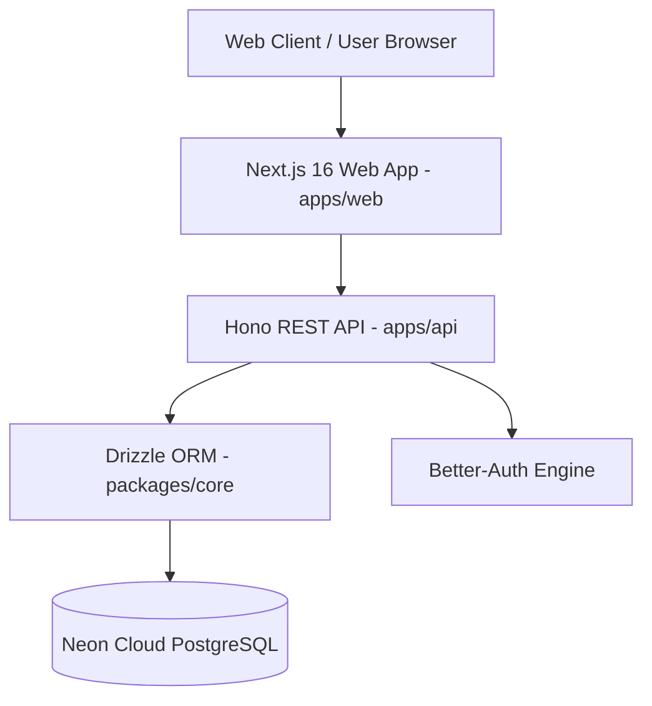

# Software Requirements Specification (SRS) - Reseror

## 1. Introduction

**Purpose:**  
This document specifies the requirements for **Reseror**, a comprehensive travel & hospitality booking platform for discovering, searching, and managing luxury hotels, beachfront villas, restaurants, curated travel articles, and promotional deals across Sri Lanka.

**Scope:**  
Reseror consists of:
- **Web Frontend (`apps/web`)**: Next.js 16 (App Router), TailwindCSS, React 19, Radix UI, TanStack Query.
- **Backend API (`apps/api`)**: Hono framework running on Bun runtime with Drizzle ORM.
- **Shared Core (`packages/core`)**: Shared Drizzle PostgreSQL database schemas, Zod validation schemas, migrations, and shared utilities.

---

## 2. Overall Description

**User Roles & Personas:**
- **Guest / Public Explorer**: Discovers hotels, villas, restaurants, curated travel destinations, and promotional deals.
- **Registered User**: Saves favorite properties to wishlists, manages bookings/inquiries, and updates profile settings.
- **Hotel / Property Owner**: Manages hotel details, room types, pricing, restaurant listings, reviews, and advertisements.
- **Super Administrator**: System-wide management of destinations, property attributes, booking commission rates, site info, user accounts, and ad placements.

**Core Modules & Capabilities:**
1. **Landing & Exploration**: Hero search bar, featured hotels, luxury villas, trending dining, Sri Lankan destinations, and travel articles.
2. **Hotel & Villa Booking System**: Room availability, filterable search (city, price, stars, amenities), detailed property views, and inquiry submissions.
3. **Restaurant & Dining**: Restaurant showcase, table availability, menus, and reservation management.
4. **Promotional Deals & Ads**: Ad placement system for featured partner deals with custom booking inquiries.
5. **Destination & Content Hub**: Destination guides and travel blogs with read tracking and categorization.
6. **Authentication & Authorization**: Multi-role authentication powered by `better-auth` (Email/Password, session management, organization scopes).
7. **Administration & Analytics**: Comprehensive admin panel for property verification, staff management, payment records, site branding, and legal policies.

---

## 3. System Architecture & Tech Stack

- **Runtime & Package Manager**: Bun
- **Database**: Neon Cloud PostgreSQL (51+ managed schema tables)
- **Deployment Platform**: Cloudflare Pages / Vercel (Frontend) & Cloudflare Workers / Node / Bun Server (Backend API)

---

## 4. Functional Requirements

### 4.1 Frontend Web App (`apps/web`)
- **Public Showcase**: High-impact responsive UI featuring dynamic brand typography, image fallbacks, and glassmorphism styling.
- **Advanced Hotel Search**: Multi-filter search interface by destination, check-in/out dates, price ranges, property class, and amenity tags.
- **Villa & Stay Cards**: Interactive cards with wishlist toggling, hover transitions, and visual image fail-safes.
- **Booking & Inquiry Flow**: Multi-step booking/inquiry forms for hotels, villas, restaurants, and deals.

### 4.2 API Backend (`apps/api`)
- RESTful OpenAPI endpoints for all entities (`/api/hotels`, `/api/villa`, `/api/restaurant`, `/api/destination`, `/api/article`, `/api/ads`, `/api/site-settings`).
- Authentication middleware checking session tokens via `better-auth`.
- Query pagination, sorting (`sort=desc`), filtering, and search options.

### 4.3 Shared Core Package (`packages/core`)
- Centralized Drizzle schema definitions (`hotels`, `villas`, `restaurants`, `siteSettings`, `destinations`, `roomTypes`, `articles`, `ads`, `wishlists`).
- Shared Zod validation schemas for request payload validation.
- Database migrations and reset tools.

---

## 5. Non-Functional Requirements

- **Performance**: Instant page load times leveraging Next.js Turbopack and lightweight client states.
- **Visual Excellence**: Modern typography text branding ("Reseror"), seamless hover micro-interactions, dark overlays, and robust fallback images.
- **Reliability & Resilience**: Clean fallbacks when database tables are unpopulated or external media assets fail to load.
- **Security**: Role-based route protection, parameterized database queries, and environment variable isolation.
